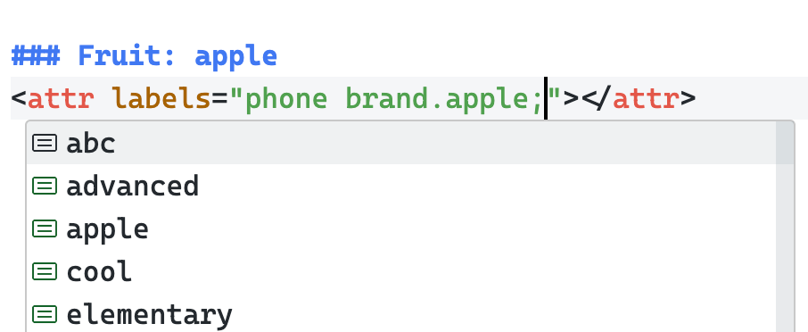

# README

## Features

- Automatically update markdown links when you move files or folders.

  Supports two formats: markdown links and `src="path/to/file.ext"`. For example: `[haha](other_doc.md#header)`, `[image](./.images/myimage.png)`, ``, etc.

  The plugin also keeps the 'id' part, like `[test](test.md#header)` — the `#header` will stay correct after moving.

  Even after lots of file and folder moves, the plugin stays accurate. The only issue: VSCode does not auto-save files you haven’t opened. You must save manually to update the plugin’s cache. Otherwise, later moves might not update all links, which could cause missing or broken text.

- Update markdown links after renaming a header

  The plugin lets you rename markdown headers with F2, and will update all links to that header in other files.

- Supports [header labels](#more-about-label)

  like this:
  ```md
  ### Matrix Transformation
  <attr labels="math;linear-algebra;matrix"></attr>
  ```

  You can name your tag freely (except for these forbidden characters: .&"'<>). Unicode is supported.

- Wrap equation mark for selected text. **This features only meaningful for non-ascii notes**, because there's no way tell the different between english text and equation content.

  For example, say we have raw text:
  ```md
  设P为可逆矩阵，则在{P}^{-1}{A}中，P称为“对{A}进行相似变换”。
  ```

  select these text and call command `markdown-note-supports.WrapSymbolWithEquationMark`, then plugin will replace these text to:
  ```md
  设 $P$ 为可逆矩阵，则在 ${P}^{-1}{A}$ 中，$P$ 称为“对 ${A}$ 进行相似变换”。
  ```

### More about label
To use labels, you need a label config file. Set its path with `markdown-note-supports.labelTreePath`. By default, it reads `./labels.tree` in your workspace.

The label config file should look like:
```tree
- labelA
  - labelC
  - labelD
    - labelF
- labelB
```

Label rules:
- No duplicate sibling labels
- Labels can't have these symbols: .%"'<>

#### Use label
Labels are only for headers. Put the label line right after the header (empty lines are allowed but not needed). For example:
```md
##### my header
<attr labels="label1;label2;label3.label4"></attr>
```

When the plugin loads the label config, it gives **auto-completion** based on it.



#### Unique label
If a label name is unique, you can use it directly. If there are duplicate label names (in different paths), you must use a 'labelpath' starting from a unique ancestor label.

For example, with this `labels.tree`:
```tree
- somelabel
  - fruit
    - apple
    - banana
  - phone brand
    - apple
    - samsung
```

You can use labels like:
```md
##### Good fruit
<attr labels="banana;fruit.apple"></attr>

##### Phone
<attr labels="samsung;phone brand.apple"></attr>

##### Others
<attr labels="samsung;somelabel.phone brand.apple"></attr>
```

You can also write the full path like `somelabel.phone brand.apple`, it's not required for the plugin to recognize it.

#### Auto Refactoring
When you modify the configuration, the plugin will analyze whether any old unique labels have become invalid (i.e., duplicate names occur) and automatically refactor the label paths that start with the unique label to make them valid. (So you can safely modify the label config file.)

#### Rename label
You can rename a label in the config file. The plugin will automatically refactor all labels in the markdown files that use this label.

Note that you can use rename and [auto refactoring](#auto-refactoring) together. Feel free to add labels and execute renames. After saving, the plugin will automatically handle all modifications (at least, that’s the design goal).

#### Select by labels
Labels help you organize knowledge (since knowledge isn't always a 'tree-structure'). For example, to see all content with the 'fruit' label, use the `select by labels` command to gather all headers with 'fruit' label.

When you run the command, a selection window appears:


> Unfortunately, VSCode doesn't have a tree-selection API, so I uses a list view

You can select multiple labels. There are two mode for selection: 'Intersection Mode' and 'Union Mode'. Intersection Mode requires the header match all labels in selection, while Union Mode requires the header match at least one label in selection.

> Note that in Union Mode, a selected label's children are **implicitly be selected**. Similarly in Intersection Mode, a selected label's ancestors are **implicitly not selected**. But both of these situation would not display on the UI (since I have no way to listen the selection change event).

After you confirm, the plugin makes a markdown file with links to all matching headers. Click a link to jump to that section.


### Todo
- [x] Warn about invalid relative links in .md
- [x] Warn about invalid labels in .md
- [ ] Cache file titles for title validation
- [ ] Add `<details>` tag folding detection with toggle fold commands (for better preview alignment)
- [ ] Parser upgrade: ignore link in code or codeblock
- [ ] Formatter (likely requires a new parser. Parser logic should be abstracted for reuse, e.g., skipping codeblocks)
- [ ] Improve label selection UI
- [ ] Publish to VSCode Extension Marketplace

## Release Notes

### v0.0.5
- new command: insert current time
- new command: minimize label path in file
- labels snippets
- label tree support comments (using `;` as separator)
- label completion supports all labels (non-unique labels show best path)
- auto fix label path in workspace when label tree config changed
- rename label in label tree

Fix:
- clear none exist diagnostics
- after moving a directory, links to directory don't updated correctly
- label path can also start from first level label (which may not be unique)
- link to current dir update incorrectly when moving folder.

Optimize:
- cache label completion

### v0.0.4
- Wrap equation mark for selected text

### v0.0.3
- Select by labels: provide union mode and intersection mode

### v0.0.2
- Improved rename (F2)
- Warn about invalid relative links in .md
- Warn about invalid labels in .md
